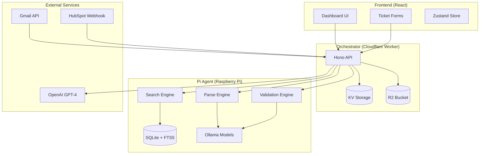
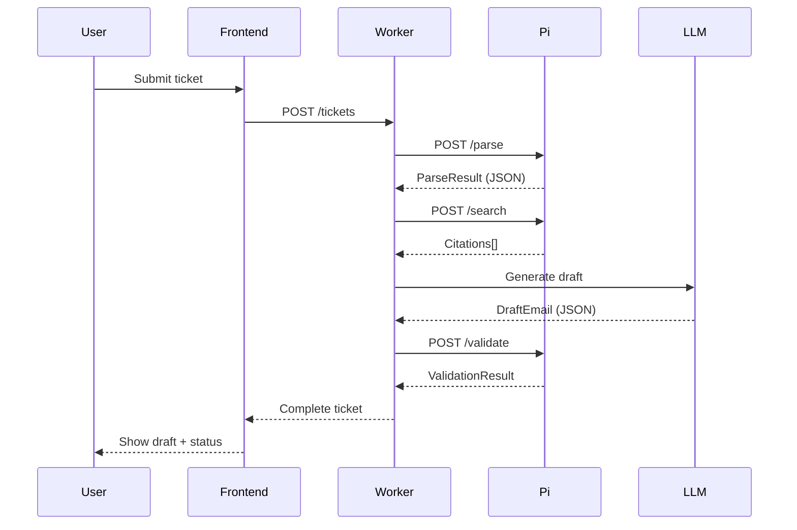
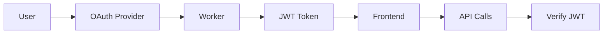

# Egregore Architecture Documentation

## System Design Philosophy

Egregore follows a **deterministic two-agent architecture** where:
- Small Language Models (SLMs) handle structured, deterministic tasks
- Large Language Models (LLMs) handle creative, natural language generation
- All communication uses strict JSON schemas for reliability

## Component Architecture



## Data Flow Sequence



## Core Design Decisions

### 1. Agent Separation
- **Pi Agent (SLM)**: Runs locally for data privacy, deterministic operations
- **Cloud LLM**: Handles only draft generation, no sensitive data processing

### 2. Deterministic JSON
- All SLM outputs use `temperature=0` and `format=json`
- Strict schema validation with Zod
- Fallback models if primary fails

### 3. Hybrid Search
- **FTS5**: Fast keyword matching (60% weight)
- **VSS**: Semantic similarity (40% weight)
- Merged scoring for best relevance

### 4. Edge-First Deployment
- Cloudflare Workers for global distribution
- React SPA with CDN delivery
- Pi Agent for local processing

## Technology Stack

### Backend Services
| Component | Technology | Justification |
|-----------|------------|---------------|
| Pi Agent | Node.js + Hono | Lightweight, TypeScript support |
| Database | SQLite + FTS5 | Embedded, fast full-text search |
| Embeddings | Ollama | Local inference, privacy |
| Worker | Cloudflare Workers | Global edge, auto-scaling |
| Storage | KV + R2 | Distributed, cost-effective |

### Frontend Stack
| Component | Technology | Justification |
|-----------|------------|---------------|
| Framework | React 18 | Component reusability |
| Styling | Tailwind CSS | Utility-first, fast development |
| State | Zustand | Simple, TypeScript-friendly |
| Routing | React Router v6 | Standard, well-documented |
| Markdown | react-markdown | Safe rendering |

### Models
| Task | Model | Fallback | Rationale |
|------|-------|----------|-----------|
| Parse | phi3:mini | qwen2.5:1.5b | Small, fast, structured output |
| Embed | nomic-embed-text | - | 384 dims, good quality/size |
| Draft | gpt-4o-mini | Claude/Llama | Best instruction following |
| Validate | phi3:mini | qwen2.5:1.5b | Deterministic fact-checking |

## Deployment Architecture

### Production Setup
```
┌─────────────────────────────────────┐
│         Cloudflare Edge             │
│  ┌─────────┐       ┌─────────┐      │
│  │ Worker  │       │  CDN    │      │
│  │(Hono)   │       │(React)  │      │
│  └────┬────┘       └────┬────┘      │
│       │                 │           │
└───────┼─────────────────┼───────────┘
        │                 │
        │     Internet    │
        │                 │
┌───────┼─────────────────┼───────────┐
│       │   Office LAN    │           │
│  ┌────▼────┐       ┌────▼────┐      │
│  │   Pi    │       │ Browser │      │
│  │  Agent  │       │         │      │
│  └─────────┘       └─────────┘      │
└─────────────────────────────────────┘
```

### Scaling Strategy
1. **Horizontal**: Add more Pi devices for different regions
2. **Vertical**: Upgrade Pi RAM/CPU for larger models
3. **Edge**: Cloudflare auto-scales globally
4. **Cache**: KV for ticket caching, R2 for manuals

## Security Model

### Authentication Flow (Phase 2)


### Data Protection
- **At Rest**: SQLite encryption on Pi
- **In Transit**: HTTPS everywhere
- **Secrets**: Environment variables only
- **PII**: Never sent to LLMs

## Performance Optimization

### Caching Strategy
1. **Manual chunks**: Cached in SQLite
2. **Embeddings**: Pre-computed and stored
3. **Tickets**: 30-day KV cache
4. **Static assets**: CDN with long TTL

### Query Optimization
```sql
-- Optimized search with early filtering
WITH filtered AS (
  SELECT * FROM chunks 
  WHERE doc_id IN (
    SELECT id FROM docs 
    WHERE vendor = ? AND family = ?
  )
)
SELECT * FROM filtered
WHERE text MATCH ?
ORDER BY bm25(chunks_fts)
LIMIT 20;
```

## Monitoring & Observability

### Metrics to Track
- Parse success rate
- Search relevance (click-through)
- Draft acceptance rate
- Validation pass/fail ratio
- End-to-end latency

### Health Checks
```typescript
// Worker health aggregation
async function healthCheck() {
  const checks = await Promise.allSettled([
    fetch(`${PI_URL}/health`),
    fetch(`${OPENAI_URL}/models`),
    KV.get('health:check')
  ]);
  
  return {
    pi: checks[0].status === 'fulfilled',
    llm: checks[1].status === 'fulfilled',
    storage: checks[2].status === 'fulfilled'
  };
}
```

## Future Enhancements

### Phase 2
- [ ] Gmail OAuth integration
- [ ] HubSpot webhook receiver
- [ ] Batch ticket processing
- [ ] User authentication

### Phase 3
- [ ] Multi-tenant support
- [ ] Custom model fine-tuning
- [ ] Advanced analytics dashboard
- [ ] Mobile app

## Development Workflow

### Local Development
```bash
# Terminal 1: Pi Agent
cd apps/pi-agent
npm run dev

# Terminal 2: Worker
cd apps/worker
npm run dev

# Terminal 3: Frontend
cd apps/frontend
npm run dev
```

### Testing Strategy
1. **Unit**: Component logic
2. **Integration**: Service communication
3. **E2E**: Full ticket flow
4. **Load**: 100+ concurrent tickets

## Troubleshooting Guide

### Debug Mode
```typescript
// Enable verbose logging
export DEBUG=egregore:*
export LOG_LEVEL=debug
```

### Common Issues
| Issue | Cause | Solution |
|-------|-------|----------|
| Slow parse | Model not loaded | Pre-load models on startup |
| Search misses | Poor embeddings | Re-index with better chunking |
| Draft too long | Prompt issues | Constrain with max_tokens |
| Validation fails | Stale data | Refresh manual database |

---

*For implementation details, see source code and inline documentation.*